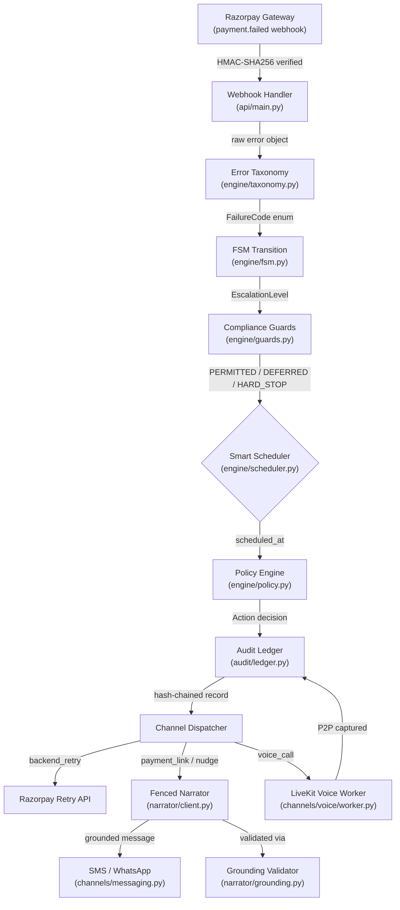
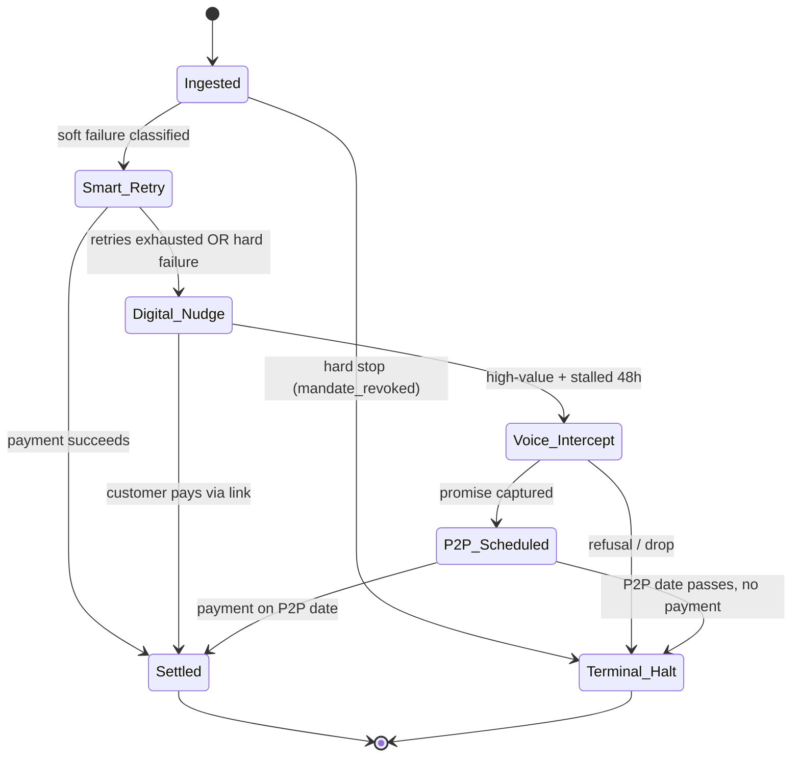

# Architecture

## System Data Flow



## Layering Rule

`engine/` may not import `sim/` or `narrator/`.  
`sim/` may not import `engine/`.  
`tests/test_layering.py` enforces this by walking the AST of every module.

## Package Structure

```
src/rra/
├── domain/          # Pure types, zero dependencies
│   ├── enums.py     # FailureCode, EscalationLevel, CaseStatus, ChannelType, ActionType
│   └── models.py    # Case, Action, Outcome, AuditRecord (pydantic, integer paise)
│
├── sim/             # SEALED ground truth — the oracle
│   ├── clock.py     # VirtualClock (UTC-aware, IST helpers, forward-only)
│   ├── rng.py       # SHA-256 CRN draw_for(seed, case_id, action_type, ordinal)
│   ├── downtime.py  # DowntimeCalendar (scheduled + seeded unscheduled outages)
│   ├── outcome_model.py  # Probability curves, salary proximity, attrition decay
│   └── portfolio.py      # Log-normal batch generator (215 cases, ₹300–₹50,000)
│
├── engine/          # Deterministic core — NO LLM, NO sim imports
│   ├── taxonomy.py  # Gateway error → FailureCode classification
│   ├── fsm.py       # Escalation level transition table
│   ├── guards.py    # 9 regulatory/operational guardrails
│   ├── scheduler.py # Salary-proximity, downtime hold-and-resume
│   └── policy.py    # Orchestrates taxonomy → FSM → guards → scheduler
│
├── narrator/        # Fenced LLM — the only place an LLM is called
│   ├── schemas.py   # NarratorRequest/Response JSON schemas
│   ├── client.py    # FencedNarratorClient with template fallback
│   ├── grounding.py # Currency/entity extraction & validation
│   └── templates.py # Deterministic message templates
│
├── audit/           # Hash-chained, tamper-evident ledger
│   └── ledger.py    # Append-only JSONL with verify_chain()
│
├── channels/        # Multi-channel delivery
│   ├── messaging.py # SMS & WhatsApp message sender
│   └── voice/       # LiveKit telephony
│       ├── worker.py   # VAD barge-in, turn-taking
│       ├── tools.py    # record_promise_to_pay tool
│       └── prompts.py  # Hinglish system prompt with prohibited_actions fence
│
├── gateway/         # Razorpay integration
│   ├── razorpay_client.py  # Test-mode API client
│   └── webhooks.py         # HMAC-SHA256 verify, idempotency; runs the policy engine on ingest
│
├── api/             # FastAPI application
│   └── main.py      # /health, /webhooks/razorpay, /cases, /cases/{id}/audit, /benchmark
│
└── bench/           # Benchmark harness
    ├── arms.py      # NaiveUnbounded, NaiveBounded, SmartBounded, SmartBoundedVoice
    ├── runner.py    # 30-day virtual simulation with CRN
    ├── metrics.py   # compute_metrics with declined_chases predicate
    └── report.py    # Generates docs/benchmark-report.md
```

## Dashboard — `web/` (Next.js 14, App Router)

A read-first narrative UI: **Result** (`/`) → **Why it works** (`/benchmark`) → **What we refused**
(`/refused`) → **Portfolio** (`/cases`), with `/case/[id]` and `/audit/[id]` drill-downs.

- Every figure is imported from `web/app/data/*.json`, written by `scripts/export_web_data.py`
  from `docs/benchmark-report.md` and `docs/shadow-decisions.jsonl`. **No hand-typed statistics.**
- Pages prefer the live API on `:8000` and fall back to committed fixtures, but the fallback is
  always surfaced (`lib/api.ts` `fetchWithFallback`, header live/fixture indicator).
- `app/api/simulate-webhook/route.ts` signs a real `payment.failed` event server-side and POSTs it
  to the API — the live-webhook demo runs the same verification + policy path as production.
- Confidence intervals are drawn, not just printed: `components/IntervalPlot.tsx` renders a dot +
  95% CI whisker against a zero line, coloured by whether the interval clears zero.

## FSM State Diagram



## Benchmark Design

Four arms, each adding exactly one design decision to the previous:

1. **NaiveUnbounded** — fixed 24/48/72h retries, no guards, no links (industry strawman)
2. **NaiveBounded** — same fixed timing, with the full guard set + digital links
3. **SmartBounded** — adds the decoupled dunning ladder (Day-1 nudge, payday-aligned auto-debit)
4. **SmartBoundedVoice** — adds a LiveKit voice intercept on stalled accounts > ₹5,000

Each adjacent pair isolates one contribution:

| Pair | Isolates |
|---|---|
| NaiveUnbounded → NaiveBounded | cost of bounded execution / channel substitution |
| NaiveBounded → SmartBounded | the decoupled dunning ladder (scheduling) |
| SmartBounded → SmartBoundedVoice | the targeted voice intercept |

Common random numbers keyed on `(seed, case_id, action_type, ordinal_within_type)` ensure arms
differ only in policy, not luck. 20 seeds × 215 cases, 30-day simulation horizon.
`make bench` reproduces `docs/benchmark-report.md` (which is never hand-edited) and refreshes the
dashboard's JSON fixtures.

## Key Invariants

1. **Integer paise money**: All financial arithmetic uses integer paise (1 INR = 100 paise). No floating-point currency math anywhere.
2. **Honesty firewall**: The scheduler's beliefs (`engine/scheduler.py`, salary window 28th–5th) and the simulator's truth (`sim/outcome_model.py`, salary peak 30th–2nd) are deliberately separate and unequal.
3. **Deterministic action IDs**: `act_` + SHA-256(`seed|case_id|action_type|ordinal`)[:12]. Bit-identical across runs.
4. **UTC enforcement**: All timestamps are timezone-aware UTC. IST conversion is explicit and never stored.
